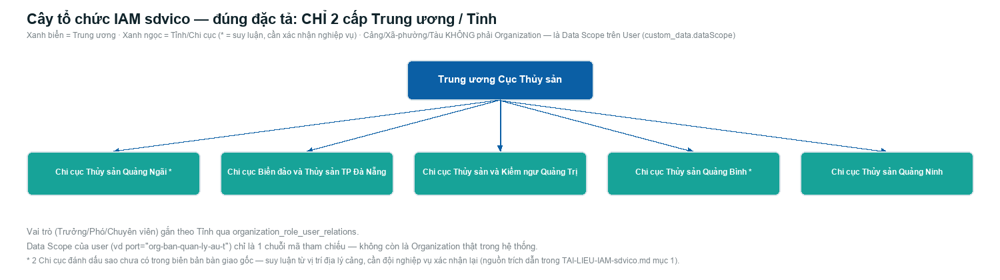
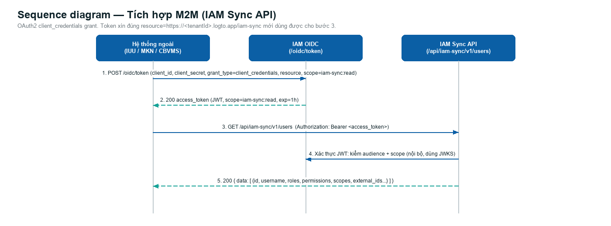
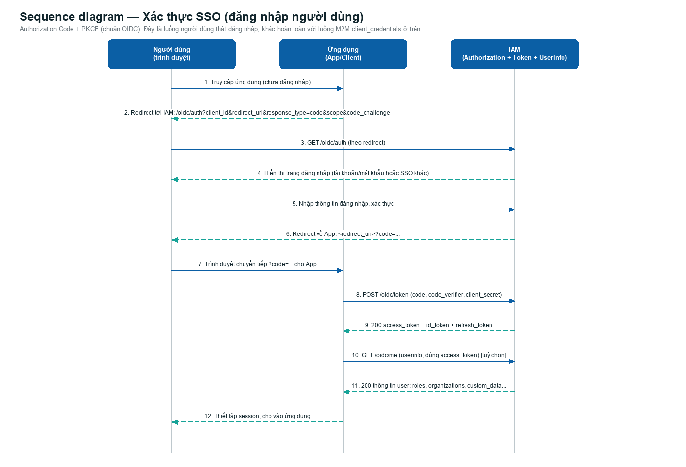

# Tài liệu hệ thống IAM sdvico

Mô hình tổ chức · Tích hợp IAM Sync API · Xác thực SSO
Cập nhật: 22/09/2026 — nội bộ dự án fork `logto-io/logto` cho sdvico.

> Thay cho bản Word trước đó (`docs/Tai-lieu-IAM-sdvico.docx`, không còn cập nhật) — từ nay dùng Markdown cho tài liệu kỹ thuật, dễ diff/review trong git hơn.

---

## 1. Mô hình tổ chức (Organization)

3 cấp: **Trung ương – Tỉnh/Chi cục – Cảng**, và **Cảng thực sự trực thuộc Chi cục** (quan hệ cha-con thật, không phải cây phẳng nằm ngang dưới Trung ương như bản đầu).

Logto không có phân cấp tổ chức (parent-child) trong schema gốc, nên toàn bộ cây này được mô phỏng qua 2 field trong `organizations.custom_data`:
- `level`: `"trung_uong"` | `"tinh"` | `"cang"`
- `parentOrgId`: id của tổ chức cha trực tiếp (chỉ Cảng mới có, trỏ về Chi cục quản lý)



**Lưu ý trung thực dữ liệu:** tất cả 16 Cảng giờ đã có `parentOrgId`. 4 Cảng xác định trực tiếp từ tên trong biên bản gốc (Đà Nẵng, Quảng Trị — tên địa danh khớp rõ với Chi cục đã có sẵn). **12 Cảng còn lại được xác định qua tra cứu tin tức chính thống** (không có trong biên bản gốc), kèm theo việc **tạo mới 2 tổ chức cấp Tỉnh chưa từng xuất hiện trong hồ sơ NKKT** — đánh dấu `*` trong sơ đồ, cần đội nghiệp vụ xác nhận lại trước khi coi là chính thức:

| Cảng | Tỉnh suy luận | Nguồn |
|---|---|---|
| Cảng DVHC Nghề cá 19/5 | Quảng Ngãi (xã Đông Sơn, cụm Sa Kỳ) | [quangngaitv.vn](https://quangngaitv.vn/dau-tu-nang-cap-ha-tang-cang-ca-6504518.html) |
| Cảng Cá Bình Châu | Quảng Ngãi (Bình Sơn, cùng cụm Sa Kỳ) | [vi.wikipedia.org](https://vi.wikipedia.org/wiki/B%C3%ACnh_Ch%C3%A2u,_B%C3%ACnh_S%C6%A1n) |
| BQL Cảng cá và Đăng kiểm tàu cá | Quảng Trị (gán vào Chi cục đã có sẵn) | kết quả tìm kiếm nêu đích danh "Quảng Trị" + vị trí liền kề nhóm Quảng Trị trong biên bản gốc |
| Cảng cá Nhật Lệ | Quảng Bình (Đồng Hới) | [quangbinh.gov.vn](https://quangbinh.gov.vn/chi-tiet-tin/-/view-article/1/13848241113627/1589692995213) |
| Cảng cá Sông Gianh | Quảng Bình (Bố Trạch) | [snn.quangbinh.gov.vn](https://snn.quangbinh.gov.vn/3cms/bql-cang-ca-quang-binh.htm) |
| Cảng cá Việt Trung | Quảng Bình | tin/FB "nước mắm Ngọc Biển Quảng Bình" |
| Chợ thủy sản - Cầu tàu Quảng Phúc | Quảng Bình (Ba Đồn) | [nhandan.vn](https://nhandan.vn/quang-binh-co-them-2-cang-cho-tau-15m-ve-boc-do-ca-giup-ngu-dan-chong-khai-thac-iuu-post848043.html) |
| Bến DVHC nghề cá Mũi Ông | Quảng Bình (Quảng Trạch) | [quangbinh.gov.vn](https://quangbinh.gov.vn/chi-tiet-tin/-/view-article/1/14012495793627/1700634546165) |

Đã kiểm chứng bằng test thật: app gán vào "Chi cục Thủy sản Quảng Bình" (mới suy luận) trả về đúng 5 Cảng vừa liệt kê ở trên, không thừa không thiếu.

Vai trò (Trưởng/Phó/Chuyên viên) gắn theo **từng Organization** qua `organization_role_user_relations`, độc lập với cây cha-con — không phải "vai trò toàn cục".

Data Scope (tỉnh/xã-phường/cảng/tàu) cũng độc lập với cây tổ chức — là thuộc tính riêng của từng User, lưu ở `users.custom_data.dataScope`.

### 1.1. Vì sao "Tỉnh thấy được Cảng trực thuộc" mà không cần cấu hình riêng

Route `GET /api/iam-sync/v1/users` khi xác định phạm vi cho 1 M2M app sẽ: lấy các Organization app là thành viên trực tiếp, rồi **đệ quy** theo `parentOrgId` để cộng thêm mọi tổ chức con/cháu. Vậy một app chỉ gán vào Chi cục Đà Nẵng (không gán riêng vào Cảng con) vẫn tự động thấy đủ user của cả Chi cục lẫn Cảng trực thuộc — đã kiểm chứng: gán app test vào `org-chi-cuc-bien-ao-` (Chi cục Đà Nẵng) trả về đúng 27 user = 13 (chi cục) + 14 (cảng con, đã trừ 1 user bị bỏ qua theo ghi chú gốc).

---

## 2. Tích hợp M2M — sdvico IAM Sync API

### 2.1. Xác thực — bằng token

OAuth2 `client_credentials` grant. Mỗi hệ thống ngoài (IUU/MKN/CBVMS) có 1 `client_id`/`client_secret` riêng, xin token cho đúng **API Resource riêng của IAM Sync** (không dùng chung quyền Management API):

```bash
curl -X POST https://<domain-sdvico>/oidc/token \
  -H "Content-Type: application/x-www-form-urlencoded" \
  -d "grant_type=client_credentials" \
  -d "client_id=<client_id>" \
  -d "client_secret=<client_secret>" \
  -d "resource=https://<tenantId>.logto.app/iam-sync" \
  -d "scope=iam-sync:read"
```

Token hết hạn sau 3600s, không có refresh token với `client_credentials` — tự xin lại khi hết hạn. Token xin cho mục đích khác (vd Management API) sẽ bị từ chối `401` do sai `audience`, dù cùng `client_id`/`client_secret` — đã kiểm chứng thực tế.

### 2.2. Sequence diagram — luồng gọi API



### 2.3. Endpoint

```
GET /api/iam-sync/v1/users
```

Không phân trang — trả toàn bộ user mà app được phép thấy trong 1 lần gọi.

### 2.4. Cấu trúc response

| Field | Kiểu | Ý nghĩa |
|---|---|---|
| `id` | string | **User ID nội bộ của IAM** — cố định, không đổi theo thời gian. Khoá chính hệ thống ngoài nên lưu lại để đối chiếu. |
| `username` / `name` / `email` | string \| null | Thông tin hiển thị |
| `status` | `active` \| `suspended` | Trạng thái tài khoản |
| `organizations[]` | `{id,name}[]` | Tổ chức user thuộc về (trong phạm vi app được phép thấy) |
| `roles[]` | `{code,name}[]` | `code` ổn định (`TRUONG`/`PHO`/`CHUYEN_VIEN`) để so sánh trong code, `name` là nhãn hiển thị tiếng Việt |
| `permissions[]` | string[] | Quyền hạn suy từ vai trò (vd `iuu:read`, `iuu:update`) |
| `scopes[]` | `{type,id}[]` | Data scope: `province`/`ward`/`port`/`vessel` |
| `external_ids` | object | Map `user_id` cũ của hệ thống ngoài — xem mục 2.6 |
| `updated_at` | ISO datetime | Lần cập nhật gần nhất |

Ví dụ thật (đã test):
```json
{
  "id": "u-chinnd-tho",
  "username": "chinnd-THO",
  "name": "Nguyễn Đức Chín",
  "email": "ducchinh030272@gmail.com",
  "status": "active",
  "organizations": [{ "id": "org-ban-quan-ly-au-t", "name": "Ban Quản lý Âu thuyền và Cảng cá Đà Nẵng" }],
  "roles": [{ "code": "CHUYEN_VIEN", "name": "Chuyên viên" }],
  "permissions": ["iuu:read"],
  "scopes": [{ "type": "port", "id": "org-ban-quan-ly-au-t" }],
  "external_ids": { "nkkt": "NKKT-00042" },
  "updated_at": "2026-09-22T04:11:37.303Z"
}
```

### 2.5. Phân quyền theo tổ chức / cấp độ

- App là thành viên Organization cấp **"Trung ương"** (`level=trung_uong`) → thấy **toàn bộ** user mọi tổ chức.
- App là thành viên Organization cấp **"Tỉnh"** cụ thể → thấy user của tỉnh đó **và mọi Cảng trực thuộc** (đệ quy theo `parentOrgId`, xem mục 1.1).
- App là thành viên trực tiếp 1 **Cảng** cụ thể → chỉ thấy user của đúng Cảng đó.
- App chưa được gán vào Organization nào → `403 auth.forbidden`.

### 2.6. Map `user_id` cũ — tránh tạo trùng khi đồng bộ lần đầu

Nếu hệ thống ngoài đã có sẵn user với `user_id` riêng trước khi tích hợp IAM:

1. **Ưu tiên** `external_ids.<tên hệ thống của bạn>` (vd `external_ids.nkkt`) — khớp chính xác 1-1 nếu đã được điền.
2. Chưa có mapping → tạm đối chiếu bằng `username`. **Không dùng `email` làm khoá chính** — dữ liệu thật đã ghi nhận 2 user dùng chung 1 email (`Vinh-THO` / `Chau-TQA`, xem `docs/sql/seed-nkkt-users.sql`).
3. Sau khi đối chiếu xong lần đầu → **lưu lại `id`** (không đổi theo thời gian) làm khoá liên kết vĩnh viễn. Từ lần đồng bộ thứ 2, chỉ dùng `id`.

### 2.7. Mã lỗi

| HTTP | code | Ý nghĩa |
|---|---|---|
| 401 | `auth.unauthorized` | Token không hợp lệ / hết hạn / sai `audience` (resource) |
| 403 | `auth.forbidden` | Thiếu scope `iam-sync:read`, hoặc app chưa gán vào Organization nào |

---

## 3. Xác thực SSO (đăng nhập người dùng)

Khác hoàn toàn với luồng M2M ở mục 2 — đây là luồng **người dùng thật** đăng nhập vào 1 ứng dụng, dùng chuẩn OpenID Connect Authorization Code kèm PKCE.



**Các bước chính:**
1. Người dùng truy cập ứng dụng → App chuyển hướng trình duyệt sang IAM kèm `code_challenge` (PKCE).
2. IAM hiển thị trang đăng nhập, người dùng xác thực.
3. IAM chuyển hướng về App kèm mã `code` dùng 1 lần.
4. App đổi `code` lấy `access_token` / `id_token` / `refresh_token` (kèm `code_verifier`).
5. App gọi `/oidc/me` (userinfo) nếu cần thông tin chi tiết (vai trò, tổ chức...).
6. App thiết lập phiên đăng nhập.

**Lưu ý:** luôn dùng PKCE kể cả khi có `client_secret`; `refresh_token` dùng để lấy `access_token` mới mà không cần đăng nhập lại; **không dùng `client_credentials` (M2M) để giả lập đăng nhập người dùng**.

---

## 4. Việc còn tồn đọng

- Đổi `client_secret` hiện tại (đang là giá trị sinh cho môi trường test) trước khi vận hành thật.
- Xác nhận domain/tenant thật khi triển khai (hiện dùng `https://default.logto.app/iam-sync` cho local).
- Xác nhận lại với đội nghiệp vụ 12 quan hệ Cảng↔Chi cục vừa suy luận từ tra cứu web (mục 1), đặc biệt 2 Chi cục Quảng Ngãi/Quảng Bình mới tạo — chưa có trong biên bản bàn giao gốc.
- Nếu cần giới hạn app nào đó chỉ thấy 1 vài tỉnh/cảng cụ thể (khác mặc định "Trung ương" = toàn quốc), báo lại để cấu hình riêng.
- Console UI (giao diện quản trị bằng tay) chưa được build — hiện chỉ có API.
