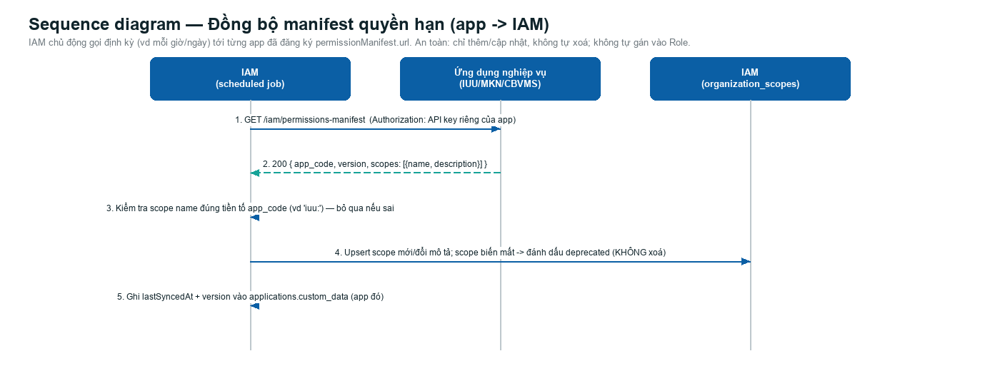

# Thiết kế (bổ sung, chưa code): IAM định kỳ lấy về permission của từng app

Trạng thái: **thiết kế, chưa triển khai**. Tính năng quan sát/audit thuần tuý — **không đổi** `organization_scopes`/`organization_roles`/cơ chế phân quyền đã duyệt. App **không cần khai/đăng ký gì trước** — IAM chủ động lấy về định kỳ và lưu lại.

## 1. Cơ chế

Mỗi app (IUU/MKN/CBVMS) expose sẵn 1 endpoint đọc được (không cần app chủ động khai báo gì với IAM trước):

```
GET <manifest_url>
Authorization: Bearer <api key riêng cho việc IAM đọc>
```

Trả về đúng bức tranh quyền hạn hiện tại của app đó:

```json
{
  "app": "iuu",
  "organizations": [{ "id": "...", "name": "..." }],
  "roles": [{ "code": "CHUYEN_VIEN", "name": "Chuyên viên" }],
  "scopes": [{ "name": "iuu:read", "description": "Đọc dữ liệu IUU" }],
  "permissions": [{ "role": "CHUYEN_VIEN", "scope": "iuu:read" }]
}
```

IAM có 1 job chạy định kỳ (vd mỗi ngày), với mỗi app đã cấu hình `manifest_url`:
1. Gọi `GET <manifest_url>`.
2. Lưu nguyên kết quả thành 1 bản ghi (snapshot), gắn `app`, `fetched_at`.
3. So với bản ghi lần trước của **chính app đó** → nếu có org/scope/role/permission nào khác → đánh dấu "có thay đổi" trong bản ghi mới.
4. Lỗi (app không phản hồi) → ghi lại lỗi, không chặn app khác, không xoá dữ liệu snapshot cũ.

**Chỉ vậy** — không ghi gì vào `organization_scopes` thật, không tự động áp dụng gì cả. Người vận hành xem lại các snapshot khi cần.

## 2. Lưu trữ

Mỗi lần lấy về = 1 bản ghi độc lập:

| Field | Ý nghĩa |
|---|---|
| `app` | Mã app (`iuu`/`mkn`/`cbvms`) |
| `fetched_at` | Thời điểm lấy về |
| `organizations` | Nguyên trạng app trả về |
| `roles` | Nguyên trạng app trả về |
| `scopes` | Nguyên trạng app trả về |
| `permissions` | Nguyên trạng app trả về (role↔scope) |
| `changed_from_previous` | true/false, so với lần lấy gần nhất của cùng app |

Đơn giản nhất: 1 bảng/log lưu nguyên JSON theo `app` + `fetched_at`, không cần chuẩn hoá phức tạp ở giai đoạn này.

## 3. Sequence diagram



*(Hình đang vẽ theo bản thiết kế cũ — sẽ cập nhật lại đúng luồng "lấy về → lưu → so lần trước" khi bắt tay code.)*

## 4. Xác thực

API key tĩnh riêng cho việc này (khác `client_secret` app dùng để gọi IAM Sync API) — app tự cấp, IAM lưu lại, đơn giản đủ dùng cho quy mô 3 app nội bộ.

## 5. Việc cần làm khi triển khai (chưa làm)

- Nơi lưu manifest_url + api key cho từng app: `applications.custom_data.permissionAudit.manifestUrl` / `.apiKey`.
- Nơi lưu snapshot: 1 bảng mới đơn giản (app, fetched_at, payload jsonb, changed boolean) — chưa có, cần migration.
- Scheduler chạy định kỳ (Logto core chưa có sẵn cron dùng chung, cần thêm).
- (Tuỳ chọn, làm sau) 1 trang Console xem lại lịch sử snapshot theo app.

## 6. Câu hỏi cần xác nhận

1. Lịch lấy về: mỗi ngày là đủ hay cần dày hơn?
2. Giữ snapshot bao lâu (không giới hạn, hay dọn sau N ngày)?
